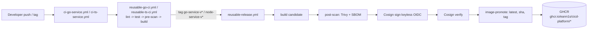
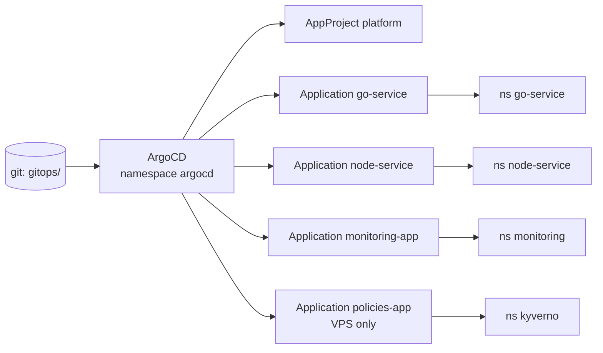
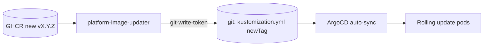
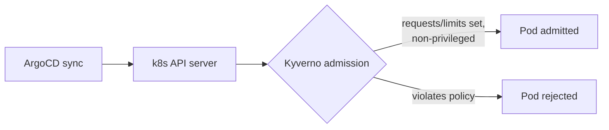
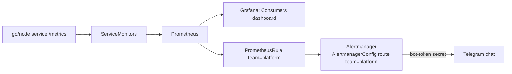
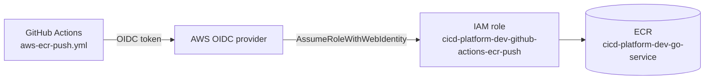
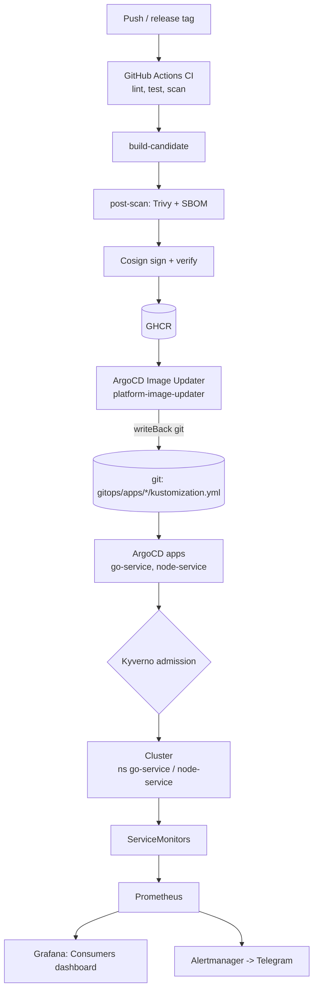

# Architecture

This document describes how the cicd-platform repository fits together: how code becomes a signed
container image, how that image lands in a Kubernetes cluster through GitOps, how new image versions
are promoted automatically, how the platform is observed and alerted on, how admission policies are
enforced, and how it connects to AWS.

Repository owner/repo throughout: `eann1s/cicd-platform`.

## Targets and responsibilities

The platform runs against three independent targets.

| Target | Cluster / footprint | Responsibility |
|--------|--------------------|----------------|
| **Local** | KinD cluster, default name `argocd` (context `kind-argocd`) | Develop and test the platform end to end. No Kyverno, no Alertmanager wiring by default. |
| **VPS / k3s** | Single-node k3s cluster, kube context `do-k3s-dev` (overridable) | The real cluster runtime: ArgoCD, Image Updater, kube-prometheus-stack + Alertmanager, Kyverno, and the consumer apps. Single-node, **not HA**. |
| **AWS dev** | `dev` account footprint | Supporting services: ECR, GitHub OIDC + IAM, S3/DynamoDB Terraform state backend, minimal VPC. **Not the app runtime.** |

Terraform installs platform components onto an **already-running** cluster (it reads `~/.kube/config`);
it does not create the KinD or k3s cluster. Create the cluster first, point kubeconfig at it, then apply.

## System overview

The platform delivers two polyglot consumer services through a single, uniform pipeline:

- `consumers/go-service`: Go HTTP service, listens on `:8080`, exposes `/healthz`, `/readyz`,
  `/metrics`.
- `consumers/node-service`: NestJS service, listens on `PORT` (default `3000`), exposes `/`,
  `/healthz`, `/readyz`, `/metrics`.

The moving parts:

- **CI/CD**: GitHub Actions workflows under `.github/workflows/` and composite actions under
  `.github/actions/`. They lint, test, scan, build, sign, and publish images to GHCR.
- **GitOps**: ArgoCD (installed via Helm by Terraform) syncs Kubernetes manifests from
  `gitops/` into the cluster. ArgoCD Image Updater promotes new image tags back into git.
- **Observability**: kube-prometheus-stack provides Prometheus + Grafana + Alertmanager;
  ServiceMonitors drive scraping; a Grafana dashboard ConfigMap renders service metrics; a
  PrometheusRule fires alerts; an AlertmanagerConfig routes them to Telegram.
- **Admission enforcement**: Kyverno ClusterPolicies (VPS target) validate every Pod created in the
  service namespaces.
- **Secrets**: SOPS + age encrypt Kubernetes Secrets in `gitops/secrets/`, applied out of band.
- **Infrastructure**: Terraform under `infra/terraform/` bootstraps the local and VPS platform
  components and the AWS dev environment (ECR, GitHub OIDC, IAM, VPC).

Image registries:

- GHCR: `ghcr.io/eann1s/cicd-platform/go-service`, `ghcr.io/eann1s/cicd-platform/node-service`.
- AWS ECR (dev): `980481493011.dkr.ecr.eu-north-1.amazonaws.com/cicd-platform-dev-go-service`.

## CI/CD flow

Entry workflows are per service and per event:

- `.github/workflows/ci-go-service.yml`: triggers on PRs and `master` pushes touching
  `consumers/go-service/**` (plus workflow/action files), and on tags matching `go-service-v*`.
- `.github/workflows/ci-ts-service.yml`: same shape for `consumers/node-service/**` and
  `node-service-v*` tags.

### PR and master push (validation only)

`ci-go-service.yml` and `ci-ts-service.yml` delegate to reusable workflows:

- Go: `.github/workflows/reusable-go-ci.yml`
- Node: `.github/workflows/reusable-ts-ci.yml`

Both run the same job chain: `lint` -> `test` -> `pre-scan` -> `build` (each `needs` the previous).

1. **lint**: golangci-lint (Go) or `npm run lint` (Node).
2. **test**: `go test -v ./...` plus `go test -race ./...` (Go), or `npm run test` (Node).
3. **pre-scan**: composite action `.github/actions/security-pre-scan`:
   - Gitleaks (`gitleaks git --exit-code 1`) for secrets, pinned image
     `ghcr.io/gitleaks/gitleaks:v8.30.1`.
   - Trivy filesystem scan (`fs`, library vuln type), report uploaded as `fs-trivy-report.json`.
4. **build**: composite action `.github/actions/build-candidate` builds with Docker Buildx
   (GHA cache, QEMU for multi-platform). Tag `<image>:candidate-${{ github.sha }}`, `publish: false`.
   On PR/master the candidate is built but not pushed.

Scan severity threshold is environment-driven: `HIGH,CRITICAL` on master/tags, `CRITICAL` on PRs.

### Release (tag push -> publish to GHCR)

Pushing a tag `go-service-v<VERSION>` (or `node-service-v<VERSION>`) runs:

- `release_meta`: strips the service prefix to derive the bare `version`.
- `ci_release`: the same reusable CI workflow (lint/test/scan/build) for the tagged commit.
- `release_push`: calls `.github/workflows/reusable-release.yml` with the extracted `tag` and
  `platforms: linux/amd64,linux/arm64`. Permissions: `contents: read, packages: write,
  id-token: write`.

`reusable-release.yml` job chain:

1. **build**: `build-candidate` with `publish: true`, tag `<image>:candidate-${{ github.sha }}`,
   outputs `image_digest`.
2. **post-scan**: `.github/actions/security-post-scan` on `<image>@<digest>`: Trivy image scan
   (`os,library`, fails on findings, `image-trivy-report.json`) and Syft SBOM
   (`anchore/sbom-action`, CycloneDX, `image-sbom.cdx.json`).
3. **sign**: `.github/actions/image-sign`: Cosign keyless (`cosign sign --yes <image@digest>`)
   using the GitHub OIDC token (`id-token: write`). Cosign v3.0.6.
4. **verify**: `.github/actions/image-verify`: `cosign verify` against
   - issuer `https://token.actions.githubusercontent.com`
   - identity `https://github.com/eann1s/cicd-platform/.github/workflows/reusable-release.yml@<ref>`.
5. **publish**: `.github/actions/image-promote`: `docker buildx imagetools create` tags the digest
   as `latest`, `${{ github.sha }}`, and the release `<tag>` (e.g. `v1.0.4`).

Manual dev publishes exist as well: `.github/workflows/dev-publish-go-service.yml` and
`dev-publish-node-service.yml` (both `workflow_dispatch`) push `<image>:dev-<sha>` to GHCR.



## GitOps deployment flow

ArgoCD runs in the `argocd` namespace. It is installed by Terraform (see [Bootstrap order](#bootstrap-order))
and its objects are bootstrapped from `gitops/argocd/`.

### Project and applications

- AppProject `gitops/argocd/projects/platform-project.yml`, name `platform`, namespace `argocd`.
  Allowed source repo `https://github.com/eann1s/cicd-platform.git`; allowed destination namespaces:
  `argocd`, `monitoring`, `go-service`, `node-service`, `kyverno`.
- Applications (all `project: platform`, `targetRevision: master`, automated sync with
  `prune: true`, `selfHeal: true`, `CreateNamespace=true`):

  | Application | Source path | Destination namespace | Notes |
  |-------------|-------------|-----------------------|-------|
  | `go-service` | `gitops/apps/go-service` | `go-service` | Consumer app |
  | `node-service` | `gitops/apps/node-service` | `node-service` | Consumer app |
  | `monitoring-app` | `gitops/monitoring/observability` | `monitoring` | Dashboard + PrometheusRule + AlertmanagerConfig |
  | `policies-app` | `gitops/policies/kyverno` | `kyverno` | Kyverno ClusterPolicies (registered by the **VPS** gitops-bootstrap only) |

The local gitops-bootstrap registers the first three apps plus the Image Updater CR. The VPS
gitops-bootstrap also registers `policies-app`. (Kyverno itself is only installed by the
VPS platform root, so the policies app belongs to the VPS target.)

### Rendered manifests

Each service's Kustomize app (`gitops/apps/<svc>/kustomization.yml`) renders:

- `deployment.yml`: 3 replicas, RollingUpdate (`maxUnavailable: 0`, `maxSurge: 1`), pull secret
  `ghcr-pull`, readiness `/readyz`, liveness `/healthz`, resource requests/limits. go-service
  container port 8080 (req 100m/256Mi, lim 500m/512Mi); node-service container port 3000
  (req 250m/512Mi, lim 1000m/1024Mi).
- `service.yml`: ClusterIP, port 80 -> targetPort 8080 (go) / 3000 (node).
- `namespace.yml`: the service namespace.
- `servicemonitor.yml`: Prometheus scrape config (see [Observability](#observability-flow)).

The kustomization `images:` block pins the deployed tag, e.g.
`ghcr.io/eann1s/cicd-platform/go-service:v1.0.3`. This `newTag` is what Image Updater rewrites.



## Image update / promotion flow

ArgoCD Image Updater watches GHCR and writes new tags back into git. It is configured by
`gitops/argocd/image-updater/custom-resource.yml` (kind `ImageUpdater`, name
`platform-image-updater`, namespace `argocd`):

- `updateStrategy: newest-build`, `allowTags: regexp:^v[0-9]+\.[0-9]+\.[0-9]+$`,
  platforms `linux/amd64`, `linux/arm64`.
- `writeBackConfig.method: git:secret:argocd/git-write-token`, branch `master`,
  `writeBackTarget: kustomization`.
- Application refs:
  - `go-service` -> image `ghcr.io/eann1s/cicd-platform/go-service`, kustomize target `go-service`.
  - `node-service` -> image `ghcr.io/eann1s/cicd-platform/node-service`, kustomize target
    `node-service`.

End to end: the release pipeline publishes a new semver tag to GHCR -> Image Updater detects the
newest build -> authenticates with the `git-write-token` secret -> updates `images[].newTag` in
`gitops/apps/<svc>/kustomization.yml` and commits to `master` -> ArgoCD's automated sync rolls the
new image out with zero-downtime RollingUpdate.



## Admission enforcement flow (Kyverno)

Kyverno is installed by the VPS platform root (Helm chart `kyverno` v3.8.1, namespace `kyverno`) and
its ClusterPolicies are delivered by GitOps through `policies-app` (`gitops/policies/kyverno`,
Kustomize). Both policies are `validationFailureAction: Enforce` and match Pods only in the
`go-service` and `node-service` namespaces:

- `require-resources`: every container must declare CPU and memory **requests and limits**. A Pod
  missing any of them is rejected at admission.
- `disallow-privileged-containers`: containers must not be privileged; the Pod must not use host
  namespaces (`hostPID`, `hostNetwork`, `hostIPC`); volumes must not use `hostPath`.

Because the policies enforce the same resource shape the deployments already declare, a correctly
authored consumer app is admitted; a regression (dropped limits, a privileged container) is blocked
before it runs. This is admission-time **policy** enforcement, not image-signature enforcement,
Cosign verification still happens only inside the release pipeline (see [Security](security.md)).



## Observability flow

The monitoring stack is kube-prometheus-stack (Helm release `kube-prometheus-stack`, chart
v85.2.2) in the `monitoring` namespace, installed by Terraform. It provides the Prometheus
Operator, Prometheus, Grafana, and Alertmanager.

On the VPS target the Helm values set
`alertmanager.alertmanagerSpec.alertmanagerConfigMatcherStrategy.type: None`, which stops
Alertmanager from auto-injecting a namespace matcher into AlertmanagerConfig objects, so the route
matchers in `consumer-services-alertmanagerconfig.yml` are then used exactly as written.

- **Scraping**: ServiceMonitors `gitops/apps/go-service/servicemonitor.yml` and
  `gitops/apps/node-service/servicemonitor.yml` live in the `monitoring` namespace with label
  `release: kube-prometheus-stack`. Each selects `app: <svc>` Services in the service namespace and
  scrapes port `http`, path `/metrics`, interval 30s, timeout 10s. The Service maps port 80 ->
  the container port (8080 go, 3000 node).
- **Metrics**: both services emit `http_requests_total` and `http_request_duration_seconds`
  (labels include `route`, `method`, `status_class`) plus runtime/default metrics. node-service uses
  custom histogram buckets `[0.005 ... 10]`.
- **Dashboard**: source `obs/grafana/dashboards/consumer-services.json` is packaged as the
  ConfigMap `consumer-services-dashboard` in
  `gitops/monitoring/observability/consumer-services-dashboard.yml` (label
  `grafana_dashboard: "1"`), deployed by the `monitoring-app` Application. Grafana's provisioning
  sidecar auto-loads it. Title "Consumers" (UID `aae1205c-041d-4a88-8817-01dca5211ccd`), panels:
  Request rate, Error rate, p95 latency, Service targets up.

### Alerting

The `monitoring-app` also delivers the alerting objects in `gitops/monitoring/observability`:

- **PrometheusRule** `consumer-services-alerts` (label `release: kube-prometheus-stack`,
  group `consumer-services.rules`). All rules carry `team: platform`:
  - `ConsumerServiceTargetDown`, `up{job=~"go-service|node-service"} == 0` for 2m (critical).
  - `ConsumerDeploymentUnavailable`, available replicas below desired for 2m (critical).
  - `ConsumerDeploymentRolloutStuck`, unavailable replicas > 0 for 5m (warning).
- **AlertmanagerConfig** `consumer-services-alertmanagerconfig`: route `receiver: telegram`,
  matching `team = platform`; the `telegram` receiver reads the bot token from the
  `alert-manager-telegram-bot-token` secret (key `bot-token`) and posts to a chat ID,
  `sendResolved: true`.

So an alert labeled `team: platform` fires in Prometheus -> Alertmanager matches the route ->
Telegram message (and a resolved message when it clears).



## Secrets flow

Kubernetes Secrets are stored encrypted in git and applied out of band, not synced by ArgoCD.

- `.sops.yaml` (repo root), creation rule for `gitops/secrets/.*\.ya?ml$`, encrypting only the
  `data`/`stringData` fields (metadata stays plaintext) with age recipient
  `age1p6ljghzq69qywmsx9j55d3q8ydnxgw34y3vkrs646cjm5357e48q25uqdv`.
- `gitops/secrets/apply-secrets.sh`: decrypts with SOPS (age key from `SOPS_AGE_KEY_FILE`,
  default `~/.config/sops/age/keys.txt`) and pipes each into `kubectl apply -f -`.

Encrypted secrets and what they unlock:

| File | Namespace / name | Type | Unlocks |
|------|------------------|------|---------|
| `gitops/secrets/argocd/ghcr-image-updater.enc.yaml` | `argocd` / `ghcr-image-updater` | dockerconfigjson | Image Updater reading GHCR image manifests |
| `gitops/secrets/argocd/git-write-token.enc.yaml` | `argocd` / `git-write-token` | Opaque (`username`,`password`) | Image Updater committing new tags to git |
| `gitops/secrets/go-service/ghcr-pull.enc.yaml` | `go-service` / `ghcr-pull` | dockerconfigjson | kubelet pulling go-service images |
| `gitops/secrets/node-service/ghcr-pull.enc.yaml` | `node-service` / `ghcr-pull` | dockerconfigjson | kubelet pulling node-service images |
| `gitops/secrets/monitoring/alert-manager-telegram-bot-token.enc.yaml` | `monitoring` / `alert-manager-telegram-bot-token` | Opaque (`bot-token`) | Alertmanager authenticating to the Telegram bot API |

Apply them after the namespaces exist:

```bash
./gitops/secrets/apply-secrets.sh
```

## AWS integration flow

The AWS dev environment is provisioned by `infra/terraform/envs/aws/dev/` (provider aws ~> 6.0,
region `eu-north-1`, profile `cicd-platform-dev`, S3 remote backend). Its remote state backend is
bootstrapped first by `infra/terraform/bootstrap/aws-state/` (S3 bucket
`cicd-platform-dev-tfstate-980481493011`, DynamoDB lock table `cicd-platform-dev-tflock`).

AWS is a **supporting foundation**, not the app runtime. The dev environment creates a keyless push
path for GitHub Actions plus a minimal VPC:

- **OIDC provider** `aws_iam_openid_connect_provider.github_actions`, URL
  `https://token.actions.githubusercontent.com`, audience `sts.amazonaws.com`.
- **IAM role** `cicd-platform-dev-github-actions-ecr-push`, trust policy restricts the OIDC
  subject to `repo:eann1s/cicd-platform:ref:refs/heads/master` and
  `repo:eann1s/cicd-platform:ref:refs/tags/go-service-v*`. Least-privilege ECR push policy scoped to
  the go-service repository ARN (`GetAuthorizationToken` plus layer/image put operations).
- **ECR repository** `cicd-platform-dev-go-service`, IMMUTABLE tags, scan-on-push enabled.
- **VPC** `10.20.0.0/16` with two public subnets (`10.20.1.0/24`, `10.20.2.0/24` across
  `eu-north-1a`/`eu-north-1b`), internet gateway, and public route table.

Push workflow: `.github/workflows/aws-ecr-push.yml` (`workflow_dispatch`, `id-token: write`)
calls `.github/workflows/reusable-aws-ecr-push.yml`. It assumes
`arn:aws:iam::980481493011:role/cicd-platform-dev-github-actions-ecr-push` via OIDC, logs into ECR
(`aws-actions/amazon-ecr-login`), and pushes
`980481493011.dkr.ecr.eu-north-1.amazonaws.com/cicd-platform-dev-go-service:<sha>` using
`build-candidate` with `publish: true`.



## End-to-end flow



## Bootstrap order

The apply order is the same for local and VPS; only the Terraform roots and kube context differ. The
ordering rule that matters: **apply the secrets before the gitops-bootstrap**, because the bootstrap
creates the ArgoCD Applications that deploy the service pods. If `ghcr-pull` is not present yet, those
pods land in `ImagePullBackOff` until the secret exists.

### Local

```bash
scripts/kind-up.sh argocd
terraform -chdir=infra/terraform/envs/local/platform apply
./gitops/secrets/apply-secrets.sh
terraform -chdir=infra/terraform/envs/local/gitops-bootstrap apply
```

- `infra/terraform/envs/local/platform/` (providers kubernetes ~> 2.36, helm ~> 3.1), creates
  namespaces `argocd`, `go-service`, `node-service`, `monitoring`; installs Helm releases `argocd`
  (argo-cd v9.5.14), `argocd-image-updater` (v1.2.1), `kube-prometheus-stack` (v85.2.2). No Kyverno.
- `infra/terraform/envs/local/gitops-bootstrap/`: applies the AppProject, the go/node/monitoring
  Applications, and the ImageUpdater custom resource via `kubernetes_manifest`. No policies app.

Tear down with `scripts/kind-down.sh argocd`.

### VPS / k3s

The k3s cluster must already exist and be reachable through the kube context (default `do-k3s-dev`).

```bash
terraform -chdir=infra/terraform/envs/vps/platform apply
./gitops/secrets/apply-secrets.sh
terraform -chdir=infra/terraform/envs/vps/gitops-bootstrap apply
```

- `infra/terraform/envs/vps/platform/`: same namespaces plus `kyverno`; Helm releases `argocd`,
  `argocd-image-updater`, `kube-prometheus-stack` (with the Alertmanager matcher-strategy value
  above), and `kyverno` (v3.8.1).
- `infra/terraform/envs/vps/gitops-bootstrap/`: applies the AppProject, the go/node/monitoring
  Applications, the `policies-app`, and the ImageUpdater CR.

See [Operations](operations.md) for the full VPS runbook and verification steps.

## Future extensions

The following are not implemented in the current repository and are noted to avoid implying they
exist:

- ECR repositories and a release/push path for `node-service` (only `cicd-platform-dev-go-service`
  exists; the OIDC trust subject covers only `go-service-v*` tags).
- Private subnets / NAT in the AWS dev VPC (public subnets only today).
- A managed, multi-node, highly-available production cluster (the runtime is single-node k3s).
- ArgoCD-managed secret delivery (secrets are applied manually via `apply-secrets.sh`).
- Admission-time image-signature enforcement (Kyverno enforces resource/privilege policies, not
  Cosign signatures).
